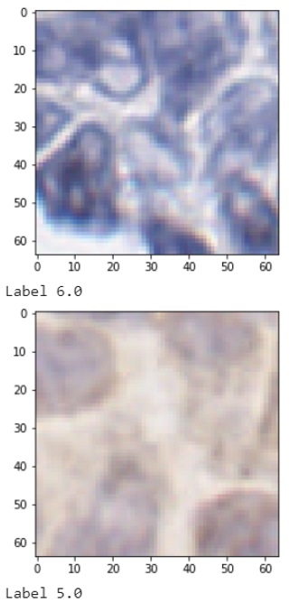

Introduction
============

Whole slide scanners (WSSs) are novel devices that scan the entire images taking an input of digital images. It depends on how much time is taken by WSSs to scan the entire image. If an image has more sets of locations (focusing points) then it will take more scanning time. Also, producing images with out-of-focus or blurry areas by WSSs which may affect the performance of the automated image analysis algorithms. Therefore, WSSs are used for whole slide imaging (WSI) to capture high-resolution tissue sections i.e., super pixel regions. WSSs are used in this project to analyze WSIs and perform focusing steps on a set of WSI’s locations (focusing points). This scanning results to achieve a good quality of images with focusing points. Python code is performed on these super pixel regions which imports these regions in the form of smaller pixel chunks and detects whether it is blurry, not blurry, in-focus, or out-of-focus using classification. Additionally, we used binary classification to check whether a super pixel region contains an artifact or not. Overall, this project aims to achieve the accuracy results of each image, provide a classified data set, and complete documentation using readthedocs.

Image - Two sample super pixel regions

The main implementation is based on the DeepFocus model which is explained in detail in the implementation section. Moreover, working and finalizing the documentation using readthedocs and data visualization.
