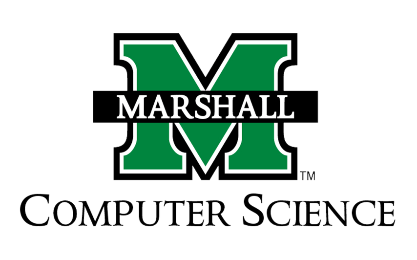

###################################
Artifact Detection Tool
###################################

CS 490/690; IS 691 Capstone Project
===================================

William Maynard, Samuel Appleton, Priya Bablani, Hassam Hussain
===============================================================

.. toctree::
   :maxdepth: 2
   :caption: Contents:

   Abstraction
   Software Requirements
   Introduction
   Validation
   Implementation
   Evaluation
   Conclusion
   References

Indices and tables
==================

* :ref:`genindex`
* :ref:`modindex`
* :ref:`search`
